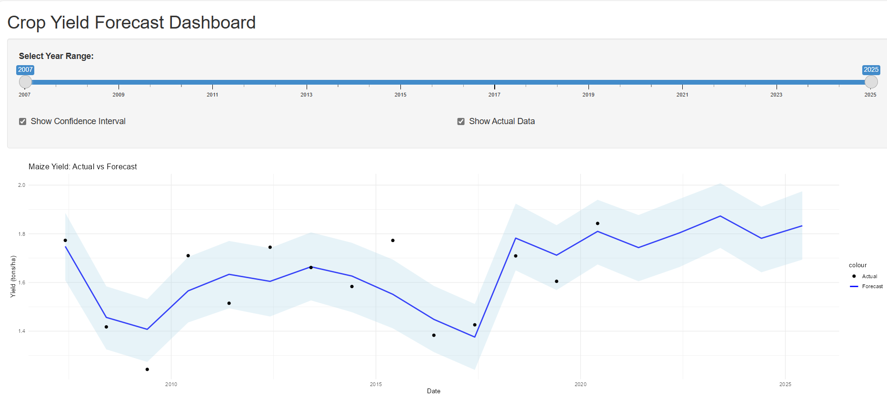
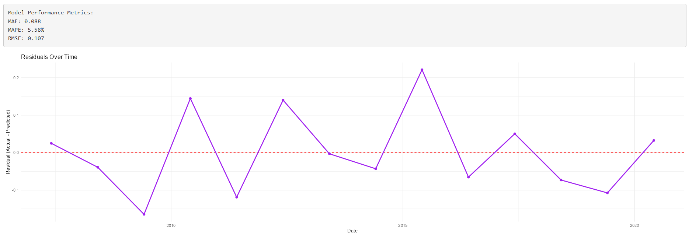

# AgroNexus AI 🌾📊

> A predictive analytics project using R and Shiny to forecast crop yields and 
support food redistribution.


AgroNexus AI is a course project developed for an Artificial Intelligence class
in the MS in Data Analytics program at Southern New Hampshire University. As 
part of my graduate coursework (expected degree conferral: December 2025), this 
project integrates time series forecasting, interactive dashboards, and 
reproducible R workflows to support strategic decision-making in agriculture and
food systems.

Designed for agribusiness stakeholders, AgroNexus AI bridges technical modeling 
with intuitive dashboards to deliver actionable insights for crop yield planning
and food redistribution.

## 🔍 Features
- 📈 **Forecasting Engine**: Uses time series modeling to predict crop yields 
                              based on historical data
- 🧠 **Interactive Dashboard**: Built with Shiny to explore forecasts, trends, 
                                and regional insights
- 🧪 **Reproducible Scripts**: Modular R scripts for data cleaning, modeling, 
                                and visualization
- 🛠️ **Git-Enabled Workflow**: Version-controlled and structured for
                                collaboration

## 📂 Project Structure
```
agronexus-ai/ 
├── app/                # Shiny dashboard (CropYieldApp.R) 
├── scripts/            # Forecasting logic (CropYieldForecast.R) 
├── data/               # Local datasets (excluded via .gitignore) 
├── agronexus-ai.Rproj  # RStudio project file 
├── LICENSE             # MIT license 
├── .gitignore          # Excludes data, history, etc. 
└── README.md           # Project overview
```

## 🚀 Getting Started

1. **Clone the repo**  
   ```bash
   git clone https://github.com/bwathier/agronexus-ai.git
   ```

2. **Open the project in RStudio**  
   Open `agronexus-ai.Rproj` to activate the RStudio environment.

3. **Run the forecasting script**  
   Execute `scripts/CropYieldForecast.R` to generate predictions.

4. **Launch the dashboard**  
   Run `runApp("app")` in RStudio to explore the interactive Shiny dashboard.

---
## 📊 Data Requirements

To run the forecasting pipeline successfully, ensure the following file is 
present in your working directory:

- `KEN_RTFP_mkt_2007_2025.csv`  
  Contains annual maize market prices for Kenya. This file enriches the 
  forecasting model with economic context. If unavailable, substitute with a 
  similar dataset or contact the project author.

---

## 📤 Outputs

Running `CropYieldForecast.R` will generate the following files for analysis 
and dashboard integration:

- `maize_yield_forecast_with_price.csv`  
  Combined historical and forecasted maize yields with confidence intervals 
  and price data.

- `model_performance_metrics.csv`  
  Summary of model accuracy using MAE, MAPE, and RMSE.

- `.RData` files for Shiny dashboard use:
  - `prophet_model.RData`
  - `prophet_forecast.RData`
  - `combined_data.RData`
  - `residuals_df.RData`

These files are saved to both the working directory and the 
Shiny app folder (`CropYieldApp/`) for seamless integration.


## 🖼️ Dashboard Preview

AgroNexus AI delivers an interactive Shiny dashboard that empowers agribusiness
stakeholders to explore crop yield forecasts, assess model performance, and 
evaluate residuals over time.

### 🔼 Forecast Panel: Controls and Interactive Plot
Users can adjust the year range, toggle actual yield data, and view confidence 
intervals to explore forecast dynamics.



### 🔽 Diagnostic Panel: Model Metrics and Residuals
Displays MAE, MAPE, and RMSE alongside a residuals plot to assess model 
accuracy and temporal bias.



## Data Sources

This project uses publicly available datasets from the following sources:

- [NASA POWER](https://power.larc.nasa.gov/) – Provides agro-climatic and solar radiation data used for environmental context and modeling inputs.
- [FAOSTAT](https://www.fao.org/faostat/en/#home) – Supplies agricultural production and yield statistics used for model training and validation.

> Note: All data was downloaded manually and is not pulled live from these sources.


## 📜 License
This project is licensed under the MIT License.  
See `LICENSE` for details.


## 📬 Contact
Developed by **Bill R. Wathier**  
Graduate Student, MS in Data Analytics  
Southern New Hampshire University

[LinkedIn](https://www.linkedin.com/in/billwathier)  
[GitHub](https://github.com/bwathier)
